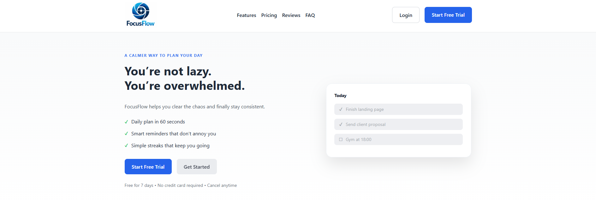
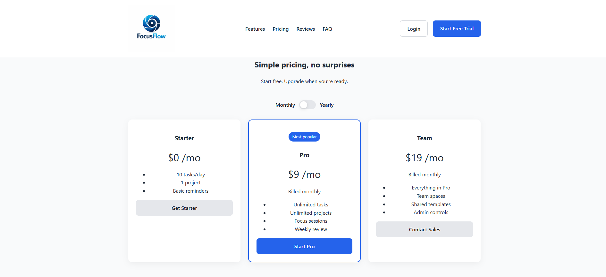
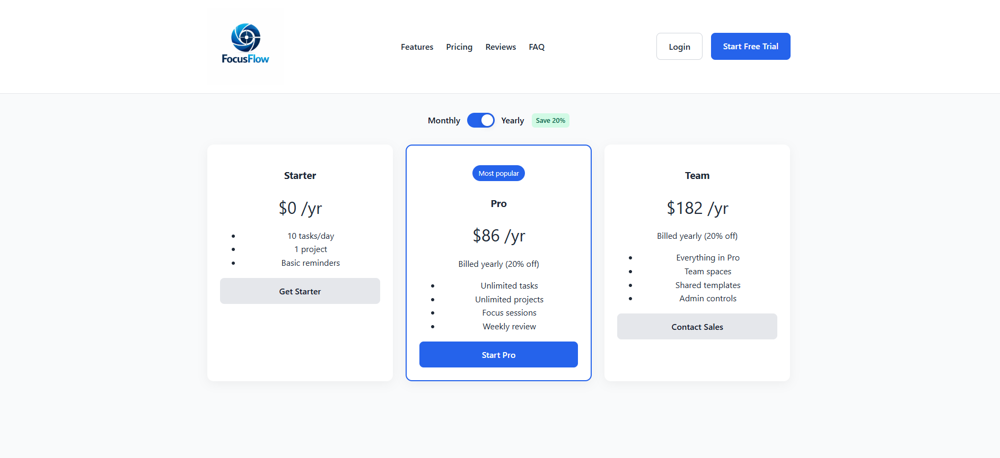
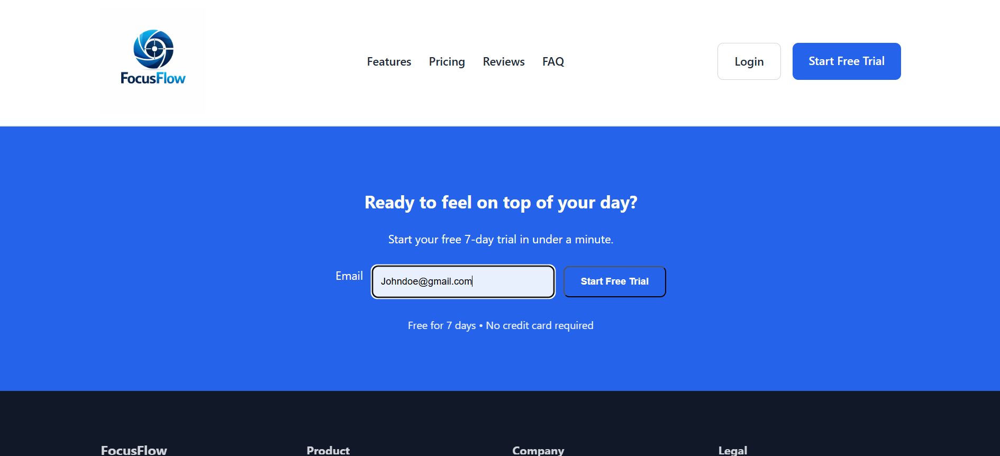
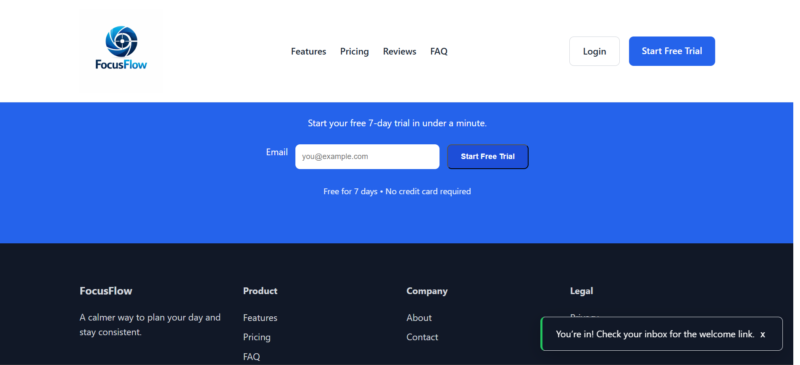
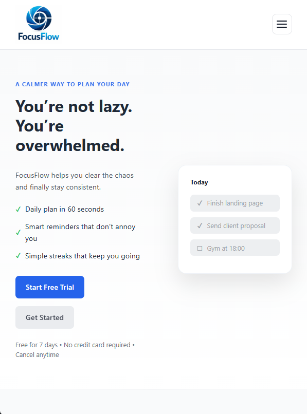
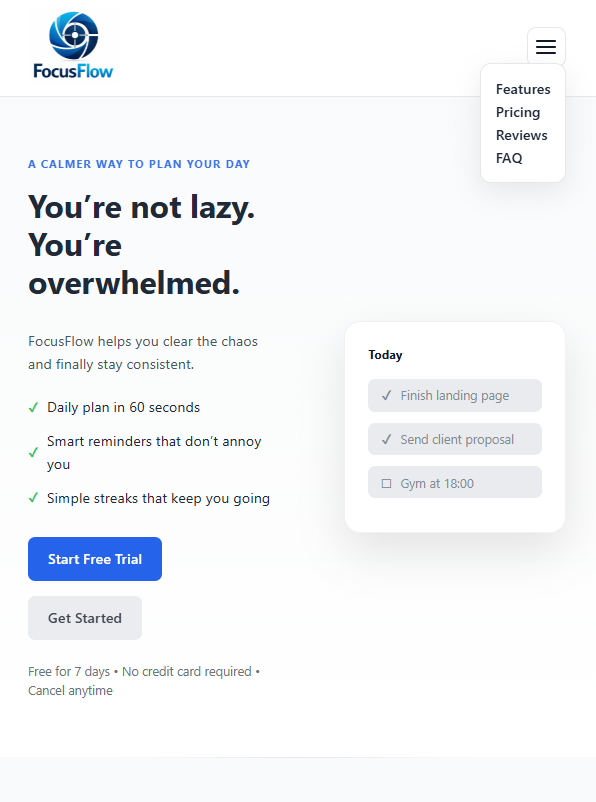
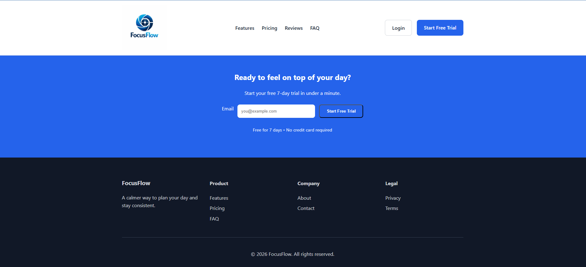

# 🚀 FocusFlow – Conversion Landing Page

A modern, responsive landing page designed to help users overcome being overwhelmed and improve productivity. Build with HTML, CSS, and JavaScript.

💡 “You’re not lazy. You’re overwhelmed.”  
A landing page designed to convert attention into action.

🔗 **Live Demo:**  
https://tryfocusflow.netlify.app/ 
[](https://app.netlify.com/projects/tryfocusflow/deploys)
---

## ✨ Overview
FocusFlow is a frontend project focused on building clean, user-friendly interfaces with meaningful interactions.  
It demonstrates the ability to translate UI concepts into a polished, responsive web experience.

---

## 🧩 Features

- 📱 **Responsive Design**  
  Fully optimized for mobile and desktop devices

- 📊 **Pricing Toggle (Monthly / Yearly)**  
  Interactive pricing switch with dynamic UI updates

- 📩 **Email Sign-up Form with Validation**  
  Client-side validation with clear user feedback

- 🔔 **Toast Notifications**  
  Real-time feedback for improved user experience

- 🍔 **Mobile Navigation Menu**  
  Smooth, accessible hamburger menu interaction

- 🔗 **Smooth Scrolling Navigation**  
  Enhances usability and flow across sections

- 🎨 **Modern UI Design**  
  Clean layout inspired by SaaS landing page patterns

---

## 🛠 Tech Stack

- **HTML5** – Semantic structure  
- **CSS3** – Flexbox & Grid for layout  
- **JavaScript (Vanilla)** – Interactivity and logic  

---

## 📸 Screenshots
Header and Hero section


Pricing toggle Montly


Pricing toggle Yearly


Email/Sign-up form


Validation & Toast Feedback


Mobile Navigation Menu


Mobile Navigation Open


Footer


---

## 🎯 What This Project Demonstrates

- Ability to build **responsive, production-style UI**
- Writing **clean, structured, maintainable code**
- Implementing **interactive frontend features**
- Focus on **user experience and feedback**
- Translating design ideas into functional interfaces

---

## 🧠 Approach

- Broke the UI into logical, reusable sections
- Focused on **user interaction and feedback**
- Ensured responsive behaviour across devices
- Prioritized readability and maintainability in code structure

---

## 📁 Project Structure

```
FocusFlow/
├── index.html
├── styles.css
├── app.js
├── screenshots/
└── README.md

- **index.html** – Page structure  
- **styles.css** – Styling and layout  
- **app.js** – Interactivity and logic  

```

## 👤 Author

**Wilmien Scheepers**  
Web Frontend Developer

...

## License

© 2026 Wilmien Scheepers. All rights reserved.

This project is shared publicly for portfolio review only. The code and design may not be copied, reused, or redistributed without permission.

...
